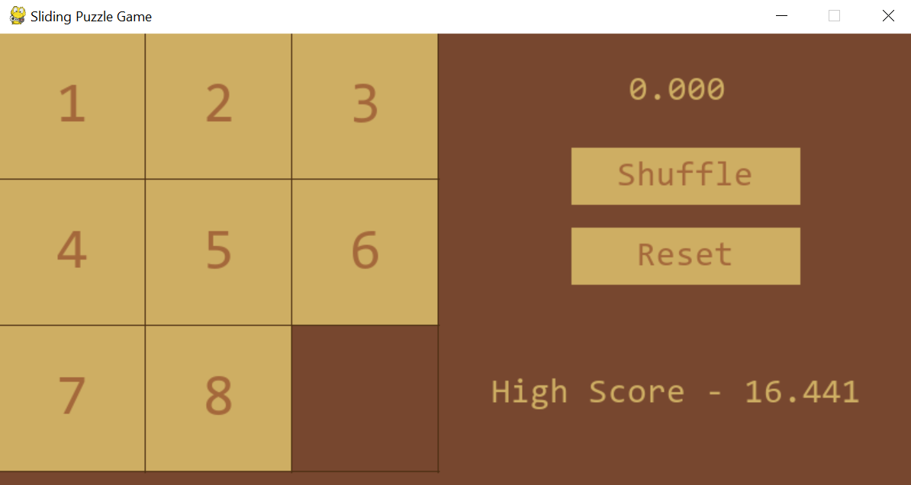

# Sliding Puzzle Game

Made by: Edelyne Keisha

Class: L1BC

NIM : 2602169850

## Video Demo

Link to the Google Drive: https://drive.google.com/drive/folders/1oQ1jjqlxAWR-KK1vaUyRVm5xyLgKfDuR?usp=sharing

## How the game works

A sliding puzzle, is a combination puzzle that challenges a player to slide flat pieces on a board to sort all the tiles correctly. The rules of the game is simple, when all the tiles are shuffled, just click on the tile that you want to move, and sort them all in the correct order from 1-8. Whoever does it the fastest gets the highest score.

## Capture of the game

